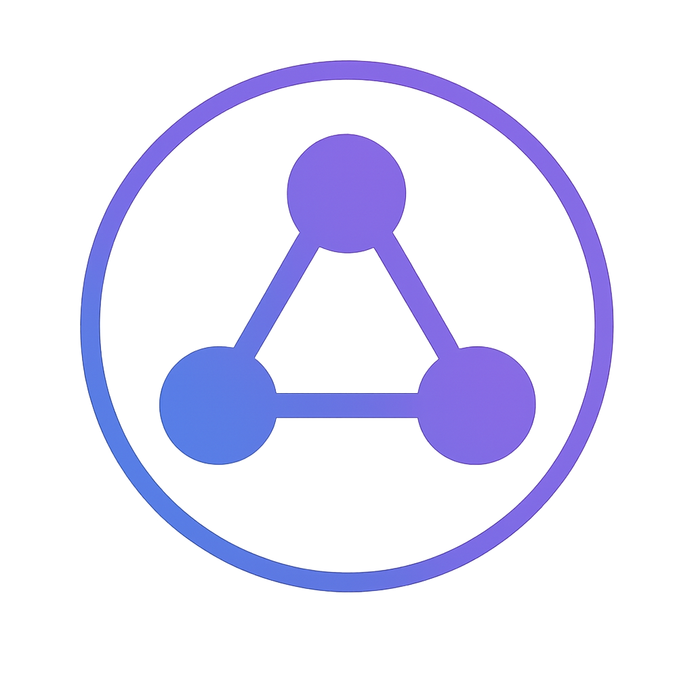

<!-- project badges or shields can go here -->

<p align="center">
  <!-- logo generated earlier -->
  <br/>
  <!-- new project icon -->
  
</p>


# funP2P – Kademlia DHT-Based P2P Network

**funP2P** began as a personal project to understand peer-to-peer networking, and it’s now evolving toward launching its own **blockchain mainnet** for fully decentralized connectivity.

**Project inquiries** → [elastic7327@proton.me](mailto:elastic7327@proton.me)
**Telegram** → [@jhe7327](http://t.me/jhe7327)

---

## Project Overview

This repository demonstrates a peer-to-peer network built on a lightweight Kademlia Distributed Hash Table (DHT). It was created to explore and experiment with core distributed-system concepts.

## Key Capabilities (via Python `kademlia`)

* Configure and manage bootstrap nodes
* Store and retrieve data in a distributed hash table
* Discover peers and create direct P2P links
* Exchange simple messages between nodes

## System Components

1. **Bootstrap Node** (`bootstrap_node.py`)

   * Entry point to the network
   * Persists DHT data
   * Assists with peer discovery

2. **Peer Node** (`peer.py`)

   * Discovers other peers through the DHT
   * Joins topic-based groups
   * Establishes direct P2P communication

## Tech Stack

* **Python 3.9+**
* **aiokademlia** – Kademlia DHT protocol implementation
* **asyncio** – asynchronous I/O
* **JSON** – data serialization

## Installation

```bash
# (Optional) create virtual env via pyenv
pyenv virtualenv 3.12.1 fun_p2p
pyenv local fun_p2p

# Install dependencies
pip install -r requirements/requirements.txt
```

## Quick Start

### 1 ▪ Run the Bootstrap Node

```bash
python bootstrap_node.py
```

The bootstrap node listens on `0.0.0.0:8468` by default.

### 2 ▪ Run a Peer Node

```bash
python peer.py
```

Each peer starts on a random port and automatically connects to the bootstrap node.

## How It Works

1. **Node Bootstrapping**

   * On startup, a peer connects to the known bootstrap node and learns the network topology via the Kademlia protocol.

2. **Peer Discovery**

   * Every peer stores its ID and address in the DHT, using topic keys (e.g., `"global-chat"`) to form interest groups.

3. **Direct Connections**

   * Using information from the DHT, peers establish direct TCP links and exchange test messages to confirm connectivity.

## System Diagram

```
┌─────────────────┐         ┌─────────────────┐
│  Bootstrap Node │◀────────▶│    Peer Node    │
└─────────────────┘         └─────────────────┘
        ▲                          ▲  ▲
        │                          │  │
        ▼                          │  │
┌─────────────────┐                │  │
│  Kademlia DHT   │◀───────────────┘  │
└─────────────────┘                   │
        ▲                             │
        ▼                             ▼
┌─────────────────┐         ┌─────────────────┐
│    Peer Node    │◀────────▶│    Peer Node    │
└─────────────────┘         └─────────────────┘
```

## Features

* **Distributed Data Storage** – key–value data is spread across the network
* **Automatic Peer Discovery** – nodes find each other without manual lists
* **Topic-Based Groups** – peers cluster around shared interests
* **Direct P2P Messaging** – communication without central servers

## Development Notes

### Known Limitations

* **NAT Traversal** – nodes behind NAT currently can’t connect directly
* **Data-Type Constraints** – DHT natively holds primitive types (work-around: JSON)
* **Security** – no encryption or authentication yet

### Planned Improvements

* NAT punch-through using STUN/TURN
* End-to-end encryption for peer traffic
* Distributed content storage for large objects
* Trust mechanisms to identify reputable peers

## License

MIT

## Contributing

Bug reports and feature suggestions are welcome via the issue tracker. Pull requests gladly accepted!
